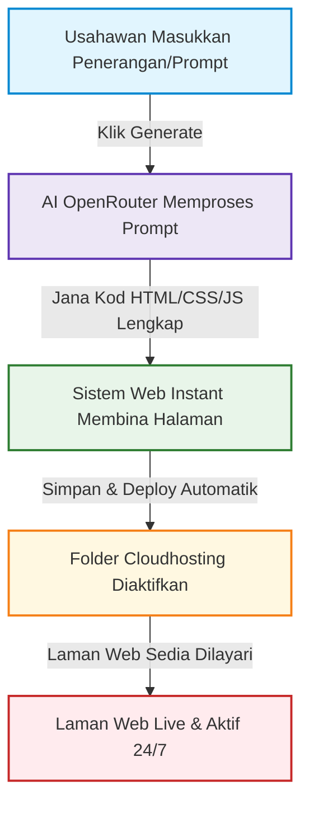

# 🚀 Panduan & Dokumentasi Prompt Generator Pro
## *Bina, Jana, dan Lancarkan Laman Web Perniagaan Anda Secara Automatik Dalam 60 Saat!*

---

## 📌 Pengenalan Mesra Usahawan

Sebagai seorang usahawan, masa adalah aset paling berharga anda. Membina laman web perniagaan atau *landing page* secara tradisional biasanya memakan masa berminggu-minggu, menelan kos ribuan ringgit, dan memerlukan kemahiran teknikal (*coding*) yang rumit. 

**Sistem Prompt Generator Pro** hadir untuk menyelesaikan masalah ini. Anda hanya perlu menulis idea perniagaan anda dalam bentuk teks biasa (*prompt*), dan sistem kami akan melakukan selebihnya secara automatik:
1. **Menjana Kod Laman Web** menggunakan kuasa AI termaju.
2. **Menyebarkan (Deploy) Serta-merta** ke halaman **Web Instant**.
3. **Menyimpan Fail** di dalam infrastruktur **Cloudhosting** yang pantas dan selamat.

> [!TIP]
> **Sifar Kemahiran Coding!** Anda tidak perlu tahu HTML, CSS, atau JavaScript. AI kami bertindak sebagai pembangun web peribadi anda yang bekerja 24/7.

---

## ⚙️ Bagaimana Ia Berfungsi (Aliran Automatik)

Sistem ini direka bentuk dengan aliran yang lancar tanpa memerlukan campur tangan manual selepas anda menekan butang "Jana Laman Web".



### 1. Proses Input Prompt (Mudah & Cepat)
Anda hanya perlu mengisi maklumat asas perniagaan seperti:
* Nama Perniagaan
* Kategori Produk/Perkhidmatan (e.g., Cafe, Klinik, Servis Aircond)
* Keunikan Jualan (USP) & Tawaran Istimewa (e.g., Diskaun 50%, Penghantaran Percuma)

### 2. Integrasi OpenRouter (Otak Kecerdasan Buatan)
Sistem ini disepadukan dengan **OpenRouter**, iaitu gerbang API AI yang menghubungkan sistem kami dengan model-model bahasa raya (LLM) terhebat dunia seperti **Claude 3.5 Sonnet** dan **GPT-4o**.
* **Kelebihan:** AI bukan sekadar menulis teks biasa; ia menjana kod pengaturcaraan yang bersih, moden, mesra peranti mudah alih (responsive), dan dioptimumkan untuk jualan (conversion-focused design).

### 3. Web Instant & Folder `cloudhosting` (Penyebaran Serta-merta)
Sebaik sahaja OpenRouter selesai menjana struktur laman web anda:
* **Web Instant Page:** Sistem akan memproses output tersebut dan membina halaman web secara langsung.
* **Folder `cloudhosting`:** Semua fail laman web (seperti `index.html`, `style.css`, dan aset gambar) akan disimpan secara automatik ke dalam direktori khusus di bawah folder `cloudhosting`.
* **Kesan:** Laman web anda terus mendapat URL aktif dan dihoskan secara langsung (*live*) di internet tanpa anda perlu membeli hosting berasingan atau melakukan persediaan server.

---

## 💎 Manfaat Utama Untuk Usahawan

| Ciri-Ciri | Cara Lama (Manual) | Cara Prompt Generator Pro |
| :--- | :--- | :--- |
| **Kos Pembuatan** | RM1,500 - RM5,000 | **Percuma / Kos Rendah (Pelan Langganan)** |
| **Masa Siap** | 2 minggu hingga sebulan | **Kurang daripada 1 Minit (Serta-merta)** |
| **Penyelenggaraan** | Perlu bayar pembangun web | **Automatik diuruskan oleh sistem** |
| **Ubah Kandungan** | Rumit, perlu edit kod asal | **Hanya jana semula dengan prompt baru** |
| **Hosting & Domain** | Perlu beli & konfigurasi sendiri | **Automatik dimasukkan ke folder Cloudhosting** |

> [!IMPORTANT]
> **Sedia Untuk Pemasaran (Ads Ready):** Laman web yang dijana didatangkan dengan struktur optimum untuk kempen pemasaran seperti TikTok Ads, Facebook Ads, dan pautan terus ke WhatsApp jualan anda.

---

## 🛠️ Panduan Integrasi Sistem (Pihak Pentadbir / Developer)

Bahagian ini menjelaskan aspek teknikal bagaimana sistem memproses prompt sehingga laman web berjaya dideploy ke folder `cloudhosting`.

### A. Konfigurasi OpenRouter
Sistem menggunakan OpenRouter untuk fleksibiliti pemilihan model AI. Berikut adalah contoh aliran panggilan API yang digunakan oleh sistem untuk menjana kod laman web:

```javascript
// Contoh Logika Panggilan AI melalui OpenRouter
async function generateWebsiteFromPrompt(userPromptData) {
  const response = await fetch("https://openrouter.ai/api/v1/chat/completions", {
    method: "POST",
    headers: {
      "Authorization": `Bearer ${process.env.OPENROUTER_API_KEY}`,
      "Content-Type": "application/json"
    },
    body: JSON.stringify({
      model: "anthropic/claude-3.5-sonnet", // Model terbaik untuk penjanaan kod frontend
      messages: [
        {
          role: "system",
          content: "Anda adalah pakar pembangun web frontend. Jana kod HTML lengkap yang responsif dan moden berserta CSS dalam tag <style> berdasarkan permintaan pengguna. Sila berikan kod HTML tulen sahaja."
        },
        {
          role: "user",
          content: `Bina landing page profesional untuk perniagaan berikut: ${JSON.stringify(userPromptData)}`
        }
      ]
    })
  });

  const data = await response.json();
  return data.choices[0].message.content;
}
```

### B. Proses Penyimpanan ke Folder `cloudhosting` (Instant Deploy)
Setelah kod HTML dijana, sistem backend (atau storan yang disepadukan) akan menyimpan fail tersebut terus ke direktori awan pengguna.

```text
cloudhosting/
├── users/
│   └── [user_id]/
│       └── [project_id]/
│           ├── index.html         <-- Kod utama yang dijana oleh OpenRouter
│           ├── css/
│           │   └── main.css       <-- Reka bentuk & tema modern CSS
│           └── js/
│               └── app.js         <-- Logika interaktif & borang WhatsApp
```

Setiap kali usahawan mengemas kini prompt mereka, sistem akan menulis semula (*overwrite*) fail di dalam direktori `cloudhosting` ini secara automatik, menjadikan proses kemas kini laman web semudah menaip teks biasa.

---

## ❓ Soalan Lazim (FAQ)

**S: Adakah saya perlu membeli nama domain sendiri?**
*J: Tidak perlu untuk permulaan! Sistem secara automatik menyediakan sub-domain percuma untuk setiap Web Instant page anda (contoh: `nama-bisnes.instantpage.web`). Walau bagaimanapun, anda boleh menyambungkan domain tersendiri (*custom domain*) anda pada bila-bila masa.*

**S: Adakah laman web ini mesra telefon pintar?**
*J: Ya, pasti! Model AI termaju yang diakses melalui OpenRouter diprogramkan untuk sentiasa menghasilkan reka bentuk berasaskan "Mobile-First" yang kelihatan sangat premium di skrin telefon pintar dan komputer.*

**S: Berapa banyak laman web yang boleh saya bina?**
*J: Bergantung pada pelan langganan Prompt Generator anda. Pelan Usahawan membolehkan anda menjana dan menghoskan sehingga 5 laman web aktif secara serentak di dalam folder Cloudhosting.*

---

> [!NOTE]
> *Dokumentasi ini dikemas kini secara berkala untuk memastikan usahawan mendapat maklumat terbaik mengenai teknologi AI dan hosting terkini.*
